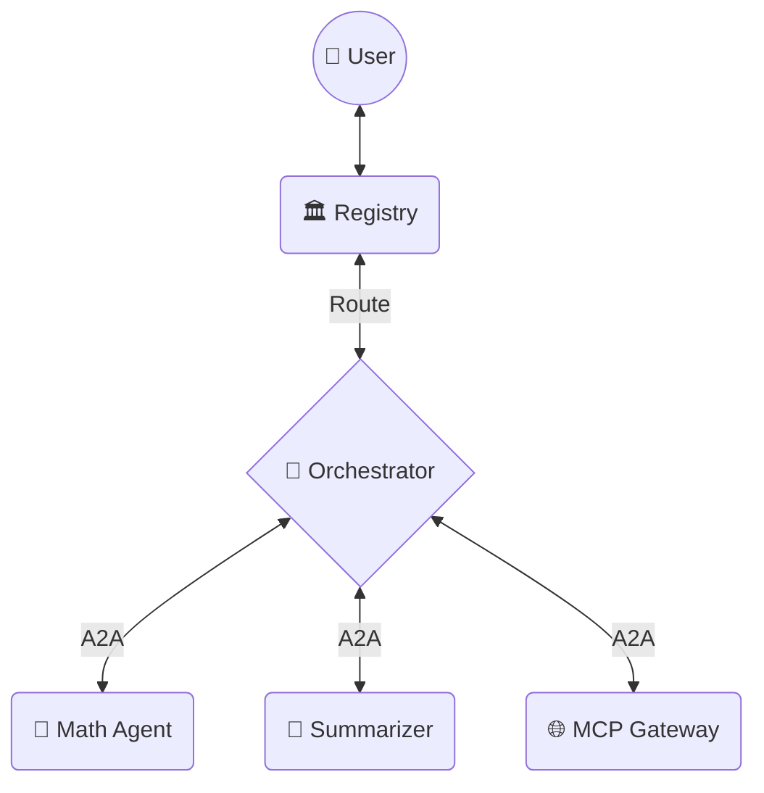

# A2A Agent Marketplace with MCP Gateway

An agent directory where AI agents register themselves, communicate using A2A (Agent-to-Agent) protocol, and a gateway bridges MCP tools into the marketplace.

## Architecture



### How It Works (Non-Technical Summary)
- **Web Interface:** Where you type your goals in plain English (e.g., "Add these numbers and format as an email").
- **Team Manager (Orchestrator):** Reads your goal, realizes it needs multiple steps, and forms a step-by-step game plan.
- **Specialist Agents:** Narrow-focused "experts" that only do one specific job (Math, Summarizing, Searching) but do it extremely well.
- **A2A Protocol:** The "Agent-to-Agent" layer that allows the Orchestrator to securely hand off intermediate results from one agent directly to the next without you intervening.

## A2A Message Format

**Agent Registration:**
```json
{ "name": "Math Helper", "description": "...", "capabilities": ["math"], "endpoint": "http://localhost:8001" }
```

**Task Request (POST /execute on any agent):**
```json
{ "task_id": "123", "capability": "math", "input": "25 * 4", "context": {} }
```

**Task Response:**
```json
{ "task_id": "123", "status": "success", "result": "100", "error": null }
```

## Prerequisites

- Python 3.10+, PostgreSQL 15, Ollama with `qwen2.5:3b`

## Setup

**1. Install dependencies**
```bash
pip install -r requirements.txt
```

**2. Create database**
```bash
psql -U apple -d postgres -c "CREATE DATABASE agent_marketplace;"
```

**3. Run migrations**
```bash
cd registry
DJANGO_SETTINGS_MODULE=config.settings python manage.py migrate
```

## Running (4 terminals)

**Terminal 1 — Registry**
```bash
cd registry
DJANGO_SETTINGS_MODULE=config.settings python manage.py runserver 8020
```

**Terminal 2 — Math Agent**
```bash
cd agents/math_agent
python app.py
```

**Terminal 3 — Summarizer Agent**
```bash
cd agents/summarizer_agent
python app.py
```

**Terminal 4 — MCP Gateway**
```bash
cd gateway
python app.py
```

**Terminal 5 — Orchestrator Agent**
```bash
cd agents/orchestrator_agent
python app.py
```

**Terminal 6 — Streamlit UI**
```bash
cd ui
streamlit run app.py --server.port 8512
```

Open http://localhost:8512

## Testing via curl

```bash
# List all agents
curl http://localhost:8020/api/agents/list

# Send math task
curl -X POST http://localhost:8020/api/orchestrate \
  -H "Content-Type: application/json" \
  -d '{"input": "25 * 4 + 10", "capability": "math"}'

# Send auto-orchestrated multi-agent task
curl -X POST http://localhost:8020/api/orchestrate \
  -H "Content-Type: application/json" \
  -d '{"input": "calculate 2^10 - 2^8 and summarize the answer", "goal": "compute then summarize", "selection_mode": "auto"}'

# Mixed math + email-style summary
curl -X POST http://localhost:8020/api/orchestrate \
  -H "Content-Type: application/json" \
  -d '{"input": "add 2 + 5 and write it in email format", "selection_mode": "auto"}'

# Mixed math + JSON summary with short explanation
curl -X POST http://localhost:8020/api/orchestrate \
  -H "Content-Type: application/json" \
  -d '{"input": "add 10 + 5 and write it in json format", "selection_mode": "auto"}'

# Mixed math + best-effort line-count summary
curl -X POST http://localhost:8020/api/orchestrate \
  -H "Content-Type: application/json" \
  -d '{"input": "calculate 2 + 200 and summarize it in 4 lines even without proper context", "selection_mode": "auto"}'

# Send summarization task
curl -X POST http://localhost:8020/api/orchestrate \
  -H "Content-Type: application/json" \
  -d '{"input": "Django is a web framework...", "capability": "summarization"}'

# Search by capability
curl "http://localhost:8020/api/agents/search?capability=math"

# List recent traces
curl "http://localhost:8020/api/traces"

# Get one trace with all A2A hops
curl "http://localhost:8020/api/traces/<task_id>"
```

## Auto Orchestration Notes

- `Auto` mode sends the task to the `Task Orchestrator` agent.
- The orchestrator plans a capability sequence and executes each step using A2A `POST /execute` calls.
- If a step fails, it tries one alternate active agent with the same capability before aborting.
- Every hop (request + response) is stored as a trace and visible in the Streamlit UI.
- For mixed prompts like "calculate ... and summarize in JSON/email/lines", the orchestrator now routes compute first, then applies summary formatting on the computed result.
- The summarizer is context-tolerant: when input context is minimal, it still summarizes available output instead of refusing.
